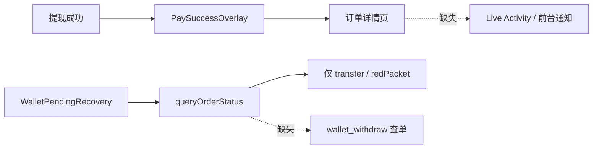
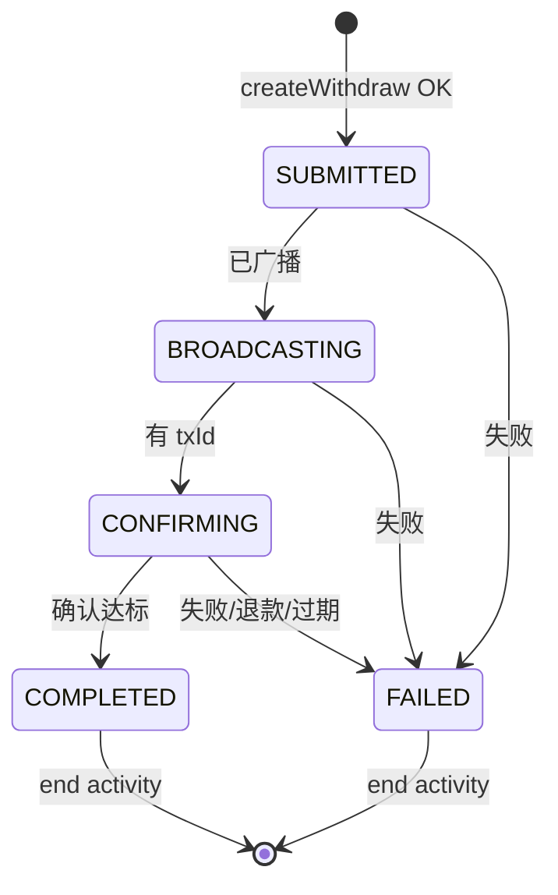
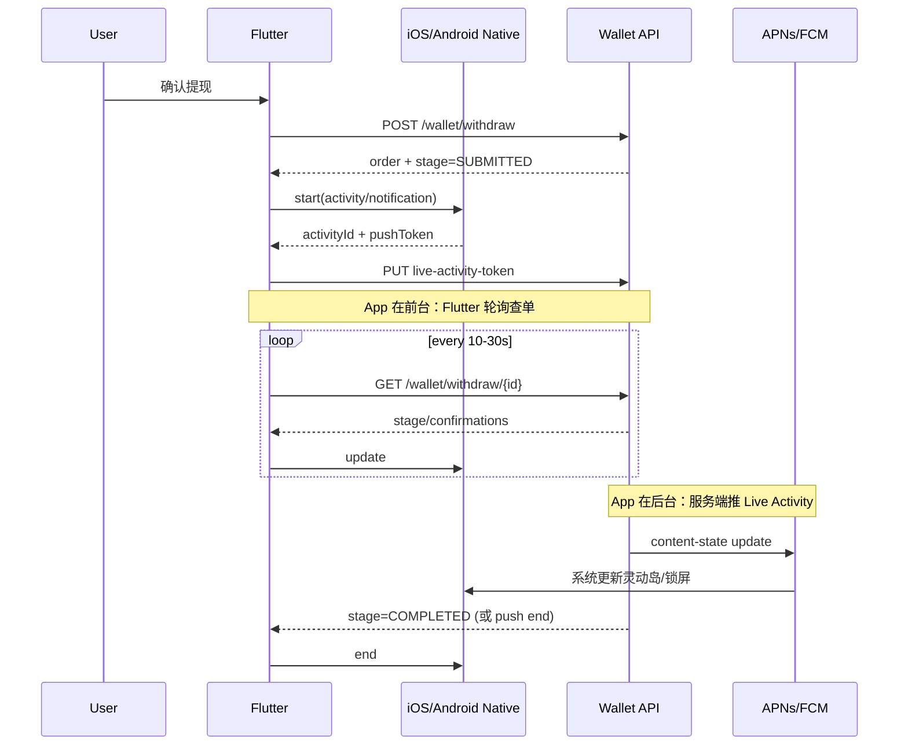

# 链上提现进度 · Live Activity / 系统通知 · 前后端改造计划

> 版本：v0.1  
> 日期：2026-08-16  
> 范围：链上 USDT 提现（`POST /wallet/withdraw`）  
> 目标：OKX 式「提交后在系统层展示进度」—— iOS 灵动岛/锁屏 Live Activity；Android 前台 Service 常驻通知

---

## 1. 目标与范围

| 项 | 说明 |
|---|---|
| **业务** | 链上 USDT 提现提交后，系统级展示进度 |
| **Phase 1** | 仅链上提现；好友内转 Phase 2 可选 |
| **终态** | `COMPLETED` / `FAILED` / `REFUNDED` / `EXPIRED` 时结束系统 UI |
| **非目标** | 不替代 App 内 `PaySuccessOverlay`；不改造 IM 推送体系 |

---

## 2. 现状缺口（必须先补）

当前客户端实现（截至 2026-08-16）存在以下缺口：

1. **无提现查单 API 封装**：`ApiWalletRepository.queryOrderStatus` 未处理 `wallet_withdraw`，会落到 `unknown`。
2. **提现未写入 Pending Store**：链上提现走 `_repo.withdraw()`，未走 `WalletOrderService.run()`，后台恢复链路未覆盖提现单。
3. **无 Live Activity / 提现前台 Service**：iOS 仅有 CallKit 灵动岛（通话）；Android 仅有聊天系统通知插件（`app_system_notification`）。



---

## 3. 统一状态机（前后端契约核心）

### 3.1 对外展示阶段（UI Stage）

客户端 Live Activity / Android 通知 **只认以下 5 档**：

| `stage` | 中文展示 | 触发条件（服务端 `status`） |
|---|---|---|
| `SUBMITTED` | 提交中 | `PENDING`, `ACTIVE` |
| `BROADCASTING` | 广播中 | `BROADCASTING` |
| `CONFIRMING` | 确认中 | `CONFIRMING` |
| `COMPLETED` | 已完成 | `COMPLETED`, `CREDITED` |
| `FAILED` | 失败/关闭 | `FAILED`, `REFUNDED`, `EXPIRED` |

> 服务端原始 `status` 仍保留；`stage` 由服务端映射下发，避免 iOS/Android/Flutter 各写一套 switch。

### 3.2 状态流转



### 3.3 与现有 Flutter 映射对齐

沿用 `lib/src/api/wallet_api.dart` 中 `_orderStateFromWalletStatus`：

| 服务端 status | Flutter `WalletOrderState` |
|---|---|
| `PENDING` / `ACTIVE` / `BROADCASTING` / `CONFIRMING` | `pending` |
| `COMPLETED` / `CREDITED` | `success` |
| `FAILED` | `failed` |
| `REFUNDED` | `refunded` |
| `EXPIRED` | `expired` |

---

## 4. 后端改造计划

### 4.1 新增/补齐 HTTP API

#### （1）提现查单 — **必须**

```
GET /wallet/withdraw/{orderId}
GET /wallet/withdraw/by-client-id/{clientOrderId}
```

**Response 约定**（与 ledger `WITHDRAW` 字段对齐）：

```json
{
  "id": "WD202608161030001",
  "clientOrderId": "WD1734420000123",
  "status": "CONFIRMING",
  "stage": "CONFIRMING",
  "currency": "USDT",
  "amount": 12000000,
  "fee": 1000000,
  "network": "TRC20",
  "toAddress": "TAjR2bhqd9EKbeH78JUDsPSGGv3ev6TBnz",
  "fromAddress": "TP4TT7nd1UEf52K2VXL3678qGbPMYnKaqj",
  "txId": "6fb2e6026c2e4d72d5b7af3dd2ad0e91ba2f43987de4f43e621cf3c55a1029af",
  "confirmations": 8,
  "requiredConfirmations": 19,
  "createdAt": "2026-08-16T15:30:00Z",
  "updatedAt": "2026-08-16T15:31:12Z"
}
```

| 字段 | 类型 | 必填 | 说明 |
|---|---|---|---|
| `id` | string | ✅ | 服务端订单号 |
| `clientOrderId` | string | ✅ | 客户端幂等 ID |
| `status` | string | ✅ | 原始状态枚举 |
| `stage` | string | ✅ | UI 五档枚举（§3.1） |
| `amount` | int | ✅ | micro 单位（与 `amountMicro` 一致） |
| `fee` | int | ✅ | micro |
| `currency` | string | ✅ | 如 `USDT` |
| `network` | string | ✅ | 如 `TRC20` |
| `toAddress` | string | ✅ | 收款地址 |
| `fromAddress` | string | 建议 | 发送地址 |
| `txId` | string | 广播后 | 链上哈希 |
| `confirmations` | int | 确认中起必填 | 当前确认数 |
| `requiredConfirmations` | int | 建议 | 默认 19（TRC20） |
| `createdAt` | string | ✅ | ISO8601 |
| `updatedAt` | string | ✅ | ISO8601 |

#### （2）创建提现响应增强 — **建议**

`POST /wallet/withdraw` 成功体在现有字段上 **必须带齐**：

```json
{
  "id": "WD202608161030001",
  "clientOrderId": "WD1734420000123",
  "status": "PENDING",
  "stage": "SUBMITTED",
  "currency": "USDT",
  "amount": 12000000,
  "fee": 1000000,
  "network": "TRC20"
}
```

#### （3）Live Activity Push Token 上报 — **必须（后台更新）**

```
PUT /wallet/withdraw/{orderId}/live-activity-token
```

**Request：**

```json
{
  "platform": "ios",
  "activityId": "A1B2C3D4-E5F6-7890-ABCD-EF1234567890",
  "pushToken": "base64EncodedPushToken",
  "bundleId": "vip.ninechat.pro",
  "environment": "production"
}
```

| 字段 | 说明 |
|---|---|
| `platform` | 固定 `ios`（Android Phase 1.5 可扩展 `android`） |
| `activityId` | ActivityKit 返回的 activity 标识 |
| `pushToken` | `pushTokenUpdates` 流中的 token，Base64 编码 |
| `environment` | `development` / `production` |

- 一个订单可多次上报（token 刷新）；服务端 **last-write-wins**。
- 仅能绑定当前登录用户自己的订单。

#### （4）设备 Push 能力注册 — **可选复用**

若已有通用设备表，增加 capability：

```json
{
  "liveActivity": true,
  "withdrawProgress": true
}
```

---

### 4.2 APNs Live Activity Push（服务端）

当链上状态变化且 App 可能不在前台时，服务端发 **Live Activity Update Push**。

**更新推送：**

```json
{
  "aps": {
    "timestamp": 1734420072,
    "event": "update",
    "content-state": {
      "orderId": "WD202608161030001",
      "stage": "CONFIRMING",
      "amountText": "12.00",
      "coin": "USDT",
      "confirmations": 8,
      "requiredConfirmations": 19,
      "txHashShort": "6fb2e6…029af"
    }
  }
}
```

**终态推送：**

```json
{
  "aps": {
    "timestamp": 1734420999,
    "event": "end",
    "content-state": {
      "orderId": "WD202608161030001",
      "stage": "COMPLETED"
    },
    "dismissal-date": 1734420999
  }
}
```

**服务端触发点：**

| 事件 | 动作 |
|---|---|
| 提现创建 | `stage=SUBMITTED`（可选 push；通常 App 前台已 start） |
| 广播出 tx | `BROADCASTING` + push update |
| 确认数变化 | `CONFIRMING` + push update（节流 ≥5s） |
| 终态 | `end` push |

**约束：**

- 使用 Apple Live Activity Push 证书/Key（与 VoIP Push **分开**）。
- `content-state` 字段必须与 Widget Extension 的 `ContentState` **完全一致**（见 §5.2）。
- 推送失败重试 + 过期 token 清理。

---

### 4.3 Android 推送（Phase 1 可选，Phase 1.5 推荐）

| 方式 | 说明 |
|---|---|
| **前台 Service（客户端主导）** | App 提交成功后本地起 Service，前台轮询查单（Phase 1 主路径） |
| **FCM 数据消息（服务端主导）** | 状态变更推 `wallet_withdraw_progress`，客户端更新通知 |

**FCM data payload 约定：**

```json
{
  "type": "wallet_withdraw_progress",
  "orderId": "WD202608161030001",
  "stage": "CONFIRMING",
  "confirmations": "8",
  "requiredConfirmations": "19"
}
```

---

## 5. iOS 原生改造计划

### 5.1 工程结构

```
ios/
  WithdrawProgressWidget/              # 新建 Widget Extension
    WithdrawProgressAttributes.swift
    WithdrawProgressLiveActivity.swift
  Runner/
    WithdrawProgressActivityManager.swift
    AppDelegate.swift                  # 注册 MethodChannel
```

**Capabilities：**

- App + Extension：`Push Notifications`
- Extension：`Live Activities`
- Runner：`Background Modes` → Remote notifications（已有可复用）

### 5.2 ActivityAttributes 约定

```swift
struct WithdrawProgressAttributes: ActivityAttributes {
    public struct ContentState: Codable, Hashable {
        var stage: String              // SUBMITTED | BROADCASTING | CONFIRMING | COMPLETED | FAILED
        var amountText: String         // "12.00"
        var coin: String               // "USDT"
        var confirmations: Int
        var requiredConfirmations: Int
        var txHashShort: String        // "6fb2e6…029af" 或 ""
    }

    var orderId: String
    var clientOrderId: String
    var network: String              // "TRC20"
}
```

**灵动岛布局：**

| 区域 | 内容 |
|---|---|
| compactLeading | USDT 图标 |
| compactTrailing | `8/19` 或阶段文案 |
| minimal | 进度点 / 勾 |
| expanded | 金额 + stage 文案 + 确认进度条 |

### 5.3 MethodChannel 约定

**Channel 名：** `wallet_withdraw_progress`

| Method | 参数 | 返回 | 说明 |
|---|---|---|---|
| `start` | `{orderId, clientOrderId, amountText, coin, network, stage}` | `{activityId, pushToken}` | 启动 Live Activity |
| `update` | `{activityId, stage, confirmations, requiredConfirmations, txHashShort}` | `bool` | 前台更新 |
| `end` | `{activityId, stage, dismissalSeconds?}` | `bool` | 终态结束 |
| `getActive` | `{orderId?}` | `{activityId, orderId, stage}` | 恢复 / 去重 |

**pushToken 回传 Flutter：** `start` 后监听 `activity.pushTokenUpdates`，Base64 上报服务端（§4.1-3）。

### 5.4 与现有 `ios_apns_push` 关系

- VoIP / CallKit 保持独立，不混用 channel。
- Live Activity push 走普通 APNs + `event=update|end`，由 Widget Extension + ActivityKit 消费，不需要 Flutter 进程常驻。

---

## 6. Android 原生改造计划

### 6.1 组件

```
android/app/src/main/kotlin/vip/ninechat/pro/wallet/
  WithdrawProgressForegroundService.kt
  WithdrawProgressNotificationBuilder.kt
  WalletWithdrawProgressPlugin.kt
```

**Channel 名：** `wallet_withdraw_progress`（与 iOS 同名，便于 Flutter 统一封装）

| Method | 行为 |
|---|---|
| `start` | 启动前台 Service + 常驻通知（进度条） |
| `update` | 更新 notification（stage / confirmations） |
| `end` | 终态通知（可自动 5s 后 cancel）+ stop service |
| `stop` | 用户手动关闭 |

**Notification Channel：** `wallet_withdraw_progress`（高优先级、不可静默）

**Deep Link：** 点击通知 → 打开 App 订单详情（`orderId` / `clientOrderId` 放 intent extra）

---

## 7. Flutter 改造计划

### 7.1 新增模块

```
lib/src/pages/wallet/progress/
  wallet_withdraw_progress_service.dart    # 统一 start/update/end
  wallet_withdraw_progress_store.dart      # 本地追踪 activityId/orderId
  wallet_withdraw_progress_mapper.dart     # API status → stage
  wallet_withdraw_progress_platform.dart   # MethodChannel 抽象
```

### 7.2 接入点

| 时机 | 动作 |
|---|---|
| `WithdrawChainReviewScreen` 提交成功 | `start(order)` + 上报 pushToken |
| `WalletPendingRecovery` / 新 `WithdrawProgressPoller` | 轮询 `GET /wallet/withdraw/{id}` → `update` |
| 进入终态 | `end` + 清本地 store |
| App 回前台 | `getActive` 与服务端状态 reconcile |

### 7.3 必改现有代码

| 文件 / 模块 | 改动 |
|---|---|
| `WalletApi` | 新增 `getWithdrawOrder` / `getWithdrawOrderByClientId` |
| `ApiWalletRepository.queryOrderStatus` | 增加 `wallet_withdraw` 分支 |
| `WalletOrderType` | 新增 `withdraw`（或统一 `businessType: wallet_withdraw`） |
| 提现成功流程 | 写入 `WalletWithdrawProgressStore` |
| `WithdrawSuccessNavigation` | 在 celebrate 后调用 `WalletWithdrawProgressService.start` |

### 7.4 前台 vs 后台策略



| 场景 | 主更新源 | 轮询间隔 |
|---|---|---|
| App 前台 | Flutter 轮询 + Native update | 10s（CONFIRMING）/ 30s（其他） |
| App 后台 iOS | APNs Live Activity Push | 不轮询 |
| App 后台 Android | 前台 Service 轮询（Phase 1） | 15–30s |
| App 被杀 Android | FCM 数据消息（Phase 1.5） | — |

---

## 8. 安全与幂等约定

| 项 | 约定 |
|---|---|
| **orderId 绑定** | pushToken 只能绑定当前登录 user 的订单 |
| **clientOrderId** | 继续作为创建幂等键（已有） |
| **Live Activity 去重** | 同一 `orderId` 只允许 1 个 active activity；重复 `start` 返回已有 `activityId` |
| **敏感信息** | 灵动岛仅展示 `txHashShort`（前 6 + 后 4），完整 hash 进 App 详情页 |
| **终态保留** | iOS `end` 后锁屏保留 0–4h 可配置 |

---

## 9. 分阶段交付

### Phase 0 — 契约冻结（1–2 天）

- [ ] 后端确认 `stage` 枚举与查单 API 字段
- [ ] 前端输出 MethodChannel 文档（本文 §5.3 / §6.1）
- [ ] 联调 mock：返回 `PENDING → BROADCASTING → CONFIRMING → COMPLETED`

### Phase 1 — 最小可用（约 1 周）

- [ ] 后端：`GET withdraw` + `POST withdraw` 增强
- [ ] Flutter：查单 + ProgressService + 提现接入
- [ ] iOS：Widget Extension + start/update/end + 前台轮询
- [ ] Android：Foreground Service + 通知进度条
- [ ] **不含** APNs Live Activity Push（后台仅显示最后一帧）

### Phase 2 — 后台实时（约 1 周）

- [ ] 后端：Live Activity Push + token 管理
- [ ] iOS：pushToken 上报与 end push
- [ ] Android：FCM 静默更新（可选）

### Phase 3 — 体验 polish

- [ ] 灵动岛 expanded 视觉、多语言 stage 文案
- [ ] 失败/退款分文案、点击跳转订单详情
- [ ] 监控：push 成功率、activity 残留、查单延迟

---

## 10. 联调检查清单

### 后端

- [ ] `stage` 与 `status` 映射表单测覆盖
- [ ] 确认数递增时 push 不风暴（节流 ≥5s 或确认数变化才推）
- [ ] token 失效自动清理

### iOS

- [ ] iPhone 14 Pro+ 灵动岛 compact / expanded
- [ ] 非 Pro 机型锁屏 Live Activity
- [ ] App 杀进程后 push 仍可更新（Phase 2）

### Android

- [ ] Android 8+ 前台 Service 限制下可正常显示
- [ ] 用户划掉通知 vs 终态自动消失

### Flutter

- [ ] 提交成功 → start → 详情页 → 返回钱包后 progress 仍在
- [ ] 终态后 activity / 通知自动结束

---

## 11. 待后端确认的问题

1. **提现查单 API 是否已存在**？若只在 ledger 里，是否接受新增 `/wallet/withdraw/{id}`？
2. **`BROADCASTING` 是否保证独立状态**，还是 `PENDING` 直接跳 `CONFIRMING`？
3. **TRC20 默认 `requiredConfirmations`** 固定 19 还是按网络配置？
4. **Live Activity Push** 是否已有 Apple Key / 是否共用现有 APNs 账号？
5. **Android 后台**：Phase 1 仅前台 Service 轮询是否可接受？

---

## 12. 附录：stage 文案（i18n 参考）

| stage | zh-Hans | en |
|---|---|---|
| `SUBMITTED` | 提交中 | Submitted |
| `BROADCASTING` | 广播中 | Broadcasting |
| `CONFIRMING` | 确认中 ({current}/{required}) | Confirming ({current}/{required}) |
| `COMPLETED` | 已完成 | Completed |
| `FAILED` | 失败 | Failed |

---

## 13. 附录：相关现有代码路径

| 模块 | 路径 |
|---|---|
| 创建提现 | `lib/src/api/wallet_api.dart` → `createWithdraw` |
| 提现查单 | `lib/src/api/wallet_api.dart` → `getWithdrawOrder` |
| 进度服务 | `lib/src/pages/wallet/progress/wallet_withdraw_progress_service.dart` |
| 提现成功导航 | `lib/src/pages/wallet/withdraw_success_navigation.dart` |
| 链上确认页 | `lib/src/pages/wallet/withdraw_chain_review_screen.dart` |
| 订单 pending 恢复 | `lib/src/pages/wallet/order/wallet_pending_recovery_service.dart` |
| 支付成功弹窗 | `lib/src/pages/wallet/widgets/pay_success_main.dart` |
| iOS 原生桥接 | `ios/Runner/WithdrawProgressActivityManager.swift` |
| iOS Widget（已写入 pbxproj） | `ios/WithdrawProgressWidget/WithdrawProgressWidgetBundle.swift` |
| Android 前台 Service | `android/.../wallet/WithdrawProgressForegroundService.kt` |
| MethodChannel | `wallet_withdraw_progress` |

## 14. iOS Widget Extension（已写入 pbxproj）

`Runner.xcodeproj` 已包含 **`WithdrawProgressWidget`** Extension Target，并完成：

- Target / Sources / Resources / Frameworks
- `Shared/WithdrawProgressAttributes.swift` 同时编译进 **Runner** 与 **WithdrawProgressWidget**（ActivityAttributes 必须一致）
- Runner → **Target Dependencies** + **Embed App Extensions** 嵌入 `WithdrawProgressWidget.appex`
- Bundle ID：`vip.99chat.pro.WithdrawProgressWidget`；Deployment Target：**16.2**；签名风格与 `NotificationService` 对齐（Manual）

**真机发布前仍需在 Apple Developer / Xcode 确认：**

1. 为 `vip.99chat.pro.WithdrawProgressWidget` 创建 App ID 与 Provisioning Profile（可与 NotificationService 共用团队 `726926SSHC`）
2. Runner 与 Extension 的 Capabilities 均开启 **Live Activities**（Runner `Info.plist` 已有 `NSSupportsLiveActivities`）
3. 用 Xcode 打开工程，检查 Signing 是否选对 Profile

**验证（本轮已执行）：**

```bash
xcodebuild -project ios/Runner.xcodeproj -target WithdrawProgressWidget \
  -configuration Debug -sdk iphoneos build CODE_SIGNING_ALLOWED=NO
# → BUILD SUCCEEDED
```

若 Live Activity 不可用（用户关闭、系统不支持等），仍会 **自动降级** 为本地通知（`WithdrawProgressActivityManager` fallback）。
