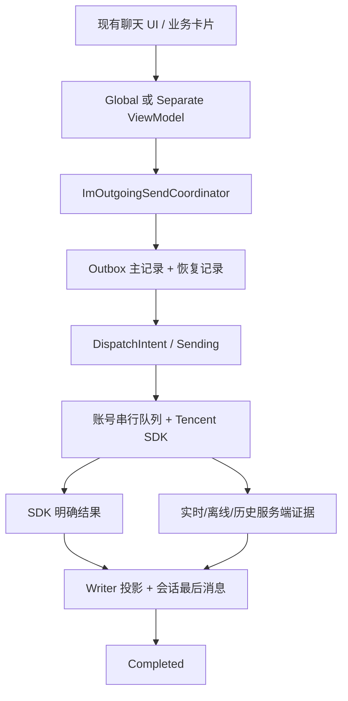
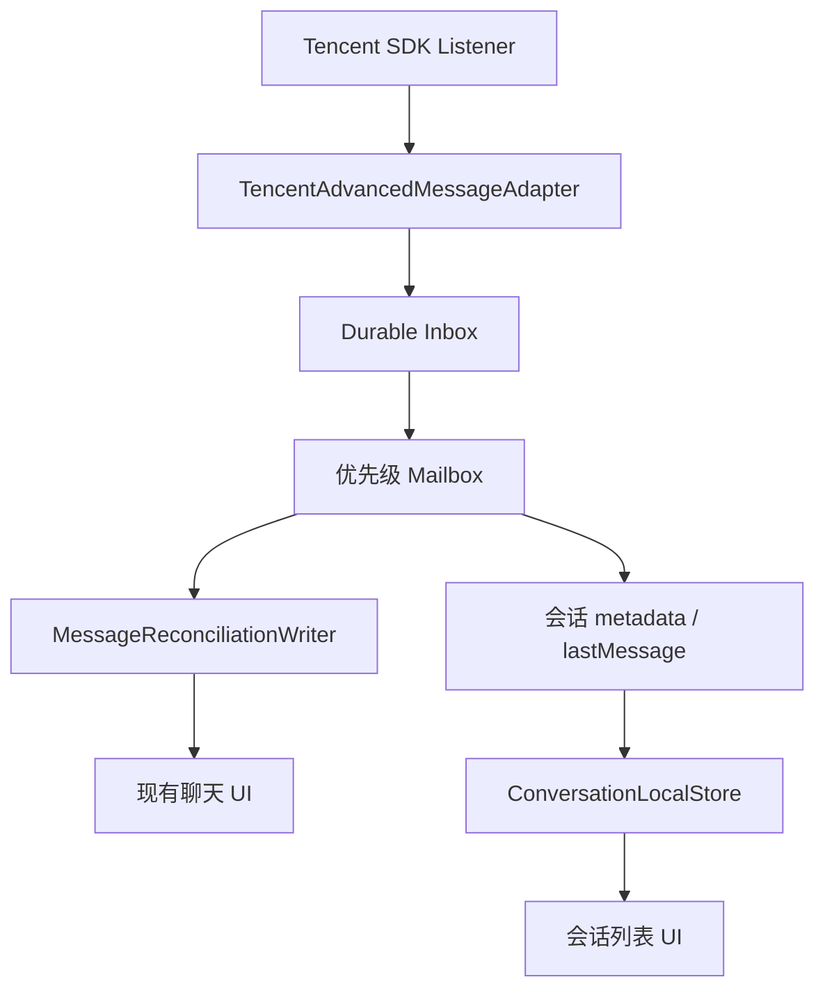
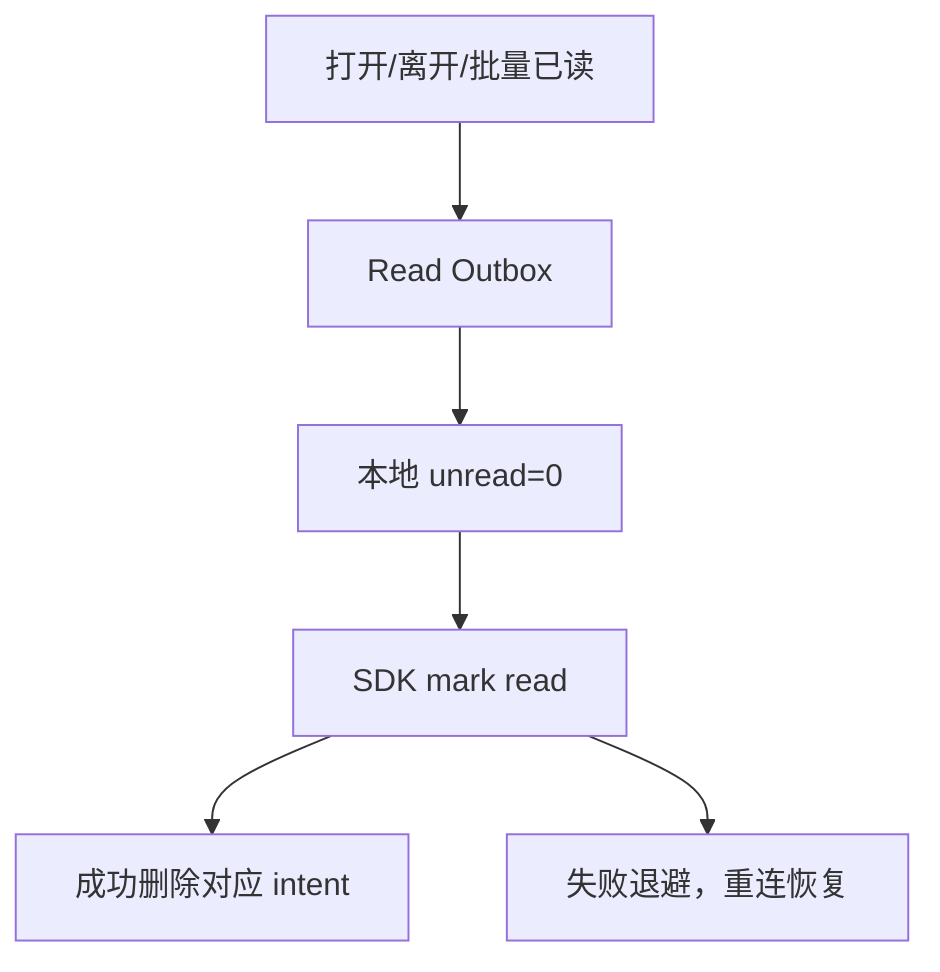

# 99chat 聊天可靠性第一批修复交接

- 日期：2026-08-30
- 范围：聊天发送、接收、会话列表、未读/已读、历史认领、连接恢复、账号切换边界
- 目标：大用户量和大消息量下不丢消息、不重复发送、不串账号、状态可恢复，保持现有 UI 壳不变

## 1. 结论

本批已经修复多项会直接造成重复发送、消息长期发送中、已读反弹、会话 Listener 永久失联和未读误清零的 P0 问题；但当前代码仍不能宣称“全部达到大规模生产门禁”。

可以确认的改善：

- 用户可见发送统一由一个 `ImOutgoingSendCoordinator` 和一份双记录 Outbox 管理。
- `OutcomeUnknown` 不自动重发，并可由实时/离线回调或历史页的服务端消息认领为成功。
- Prepared 恢复复用数据库中的原始 payload，不再因重新序列化指纹变化而自我拒绝。
- 会话已读和消息回执先持久化、SDK 成功后再确认，原生端支持跨重启恢复。
- 群系统提示只吸收一次未读增量，不再延迟多次清空整会话。
- 登录态不再伪造 socket ready；连接成功才启动恢复。
- 普通消息入库失败不再静默丢弃；会话 Listener 注册失败也有独立重试。
- 发送串行队列不再永久增长，切号前校验 owner/generation。

仍阻断“大规模生产完成”声明的核心项：Outbox 两份记录仍在同一 SQLite 故障域且 payload 未加密；媒体文件未做 durable staging；Web 已读队列仅内存；WalletPending 的 owner/epoch 和服务端业务幂等未闭环；完整 `AccountScopedRuntime`、成员快照事务、历史/搜索统一、全量 Writer 迁移、5k 会话/100 万消息性能与真机强杀证据仍缺失。

## 2. 修复后的关键调用链

### 2.1 发送、结果未知与恢复



关键不变量：

- SDK 调用前必须先落 `Prepared -> DispatchIntent -> Sending`。
- 已写 `DispatchIntent` 后崩溃只能进入 `OutcomeUnknown`，禁止自动重发。
- 只有当前账号、当前会话、`isSelf=true`，且 `operationId + clientCorrelationId + payloadFingerprint` 全部匹配，才能用 provider 消息认领成功。
- provider 消息已经先确认成功时，晚到的 SDK 超时或失败不能再把气泡标红。
- Prepared 恢复只能使用持久化的原始 envelope 和原始本地消息 ID。

### 2.2 实时消息与会话列表



失败策略：

- Adapter append/onEvent 失败进入最多 512 条的有界重试队列，批量 32，指数退避，最多 10 次。
- 首次失败会请求对应会话立即 catch-up，并启动 durable Inbox recovery。
- handler 投影失败时 Inbox 保持未完成，30 秒恢复 worker 可重放。
- 会话 Listener 和消息 Listener 分开注册、分开重试；任意一个失败不会永久拖死另一个。
- 退出/切号取消 Listener 重试、恢复计时器和账号队列。

### 2.3 未读、已读和回执



- 新 read intent 使用单调 `lastReadAtMs`；旧 ACK 不能删除更新的 intent。
- 500 是让出主线程的 chunk 大小，不再是会话截断上限。
- 消息 read receipt 在 SDK 调用前落库，只有 `code == 0` 才把 `needReadReceipt=false`。
- 一个坏 msgID 不再污染整个 100 条回执批次；失败批次递归二分定位坏行。
- 两类 read 队列最多重试 10 次，之后保留为不再热循环的 durable dead-letter。
- 群提示 effect 只扣减 1 条未读，并使用稳定 `msgKey` 做进程内幂等。

## 3. 本批已修复清单

| 范围 | 修复 | 当前结论 |
| --- | --- | --- |
| 外部/业务发送 | 删除第二套 `OutgoingExternalSendHelper`；红包、群提示、钱包卡片和外部入口使用统一 Coordinator | 已修复代码路径 |
| Outbox payload | 保存完整 `V2TimMessage.toJson()`、目标、优先级、push、receipt、custom data、审核参数 | 已修复；仍未加密 |
| Prepared 恢复 | 复用原始 envelope、校验本地 ID/账号/会话/指纹；短时重试 Message Core Lease | 已修复 |
| OutcomeUnknown | 禁止自动重发；实时/离线/历史自消息严格认领；provider 证据优先于晚 SDK 回调 | 已修复核心竞态 |
| 发送队列 | 完成后移除 conversation tail；切号清空；SDK 调用前校验账号 generation | 已修复 |
| 群提示未读 | 删除立即及 600/1500/3000ms 整会话重复清理，只吸收一次增量 | 已修复 |
| 会话已读 | 原生 SQLite read outbox，先持久化再本地清理，ACK 单调，重连恢复 | 已修复原生核心路径 |
| 消息回执 | 原生 SQLite receipt outbox，成功后改 flag，失败重试，坏 ID 隔离 | 已修复原生核心路径 |
| 批量已读 | 遍历所有会话，500 条后 yield，不再 `.take(500)` 丢尾部 | 已修复 |
| socket 状态 | 只允许真实 `onConnectSuccess` 置 ready | 已修复错误判定 |
| 消息 Listener | append/handler 错误可观测、有界重试、触发历史回补和 Inbox recovery | 已修复第一层兜底 |
| 会话 Listener | 注册失败不再静默；独立计时器重试，退出/切号清理 | 已修复 |
| 日志 | 统一发送热路径不再打印完整 localId/msgID/receiver/groupID | 已修复中心发送路径 |

## 4. 仍未关闭的问题

### 4.1 P0：发布前必须继续

| 问题 | 风险 | 下一步 |
| --- | --- | --- |
| Outbox 主/恢复记录同库 | SQLite 文件损坏或整库丢失时两份同时失效，不是真正双故障域 | 恢复副本进入独立文件/服务端；加 checksum、修复和 GC Proof |
| Outbox 明文 payload | 文本、业务 custom data 存在本地明文泄露面 | AES-GCM envelope、keyId、轮换、登出擦除 |
| 媒体只存本地路径 | 相册临时文件、缓存清理或强杀后无法恢复上传 | Outbox media staging、内容哈希、引用计数、上传断点 |
| WalletPending owner/epoch 未统一 | A 账号晚到任务可能在 B 账号恢复，金融消息或状态串账号 | owner + accountEpoch + clientOrderId；服务端幂等证据 |
| Web read outbox 仅内存 | Web 刷新/崩溃后已读和回执可反弹/丢失 | IndexedDB 实现，与原生状态机一致 |
| 完整 AccountScopedRuntime 未落地 | 静态 Map/Timer/Bus 仍分散，切号资源可能残留 | 统一 runtime owner、close、generation/fencing；资源归零测试 |
| 历史/搜索仍有多入口 | 搜索跳转、上翻、实时并发可能出现重复、缺口或锚点错误 | 所有入口统一到 IM-06 Coordinator 和同一 comparator |
| 成员 snapshot/cursor 非单事务 | 大群成员分页崩溃时快照不完整或 cursor 越界 | snapshot version + cursor + rows 同事务提交 |
| 会话排序 comparator 未唯一 | 时间相同、seq/random 异常时最后消息和排序可能抖动 | 一个 MessageOrderComparator + property test |
| Writer 迁移未完成 | 业务代码仍有兼容快照写入，未来改动可能恢复双事实源 | 当前静态扫描有 16 处 `setMessageList` 调用（不含定义），逐条迁移并设 CI 门禁 |
| socket DEGRADED/relogin 未闭环 | 长时间连接不上只显示 connecting，没有有界重登录和告警 | 3 次指数退避、DEGRADED、恢复指标 |

### 4.2 P1：规模、体验和运维

- Adapter fallback 是内存队列；进程在重试前被杀时，一次性修改/撤回/回执仍需独立 durable fallback。
- 群提示 `_absorbedEffectIds` 是进程内幂等；跨重启 effect ledger 尚未接入。
- read dead-letter 有保留但没有用户/运维查询、告警、定期 GC 和人工重放界面。
- 仍有 60 处聊天核心范围的 `catch (_)`；部分是有意隔离 callback，部分仍需逐条分类为 IGNORE/RETRY/DEAD_LETTER。
- 巨型 `tui_chat_global_model.dart` 和 `tui_chat_separate_view_model.dart` 仍有高耦合，改动回归面过大。
- 5k 会话的增量列表刷新、100 万历史记录的分页/搜索、图片解码、预取和行高度缓存尚无统一基准证据。
- 没有覆盖 24/72 小时弱网 soak、群洪峰、前后台抖动、双设备、磁盘满、数据库损坏、时钟回拨。
- 全仓日志仍存在打印 conversation/group 等标识的旧诊断点；本批只清理中心发送和新增错误路径。

## 5. 修改文件

主要生产文件：

- `lib/src/services/im/outgoing_send_coordinator.dart`
- `lib/src/services/im/outgoing_outbox_recovery_service.dart`
- `lib/src/services/im/im05_persistence.dart`
- `lib/src/services/im/im05_contracts.dart`
- `lib/src/services/im/tencent_advanced_message_adapter.dart`
- `lib/src/services/im/read_outbox_store.dart`
- `lib/src/services/im/read_receipt_outbox_store.dart`
- `lib/src/services/im/read_receipt_outbox_recovery_service.dart`
- `lib/src/services/chat_external_message_sender.dart`
- `lib/src/services/conversation_local/conversation_sync_service.dart`
- `lib/src/services/conversation_unread_clear_service.dart`
- `lib/src/services/group_conversation_unread_helper.dart`
- `lib/src/services/im_connect_status_service.dart`
- `third_party/tencent_cloud_chat_uikit/lib/business_logic/view_models/tui_chat_global_model.dart`
- `third_party/tencent_cloud_chat_uikit/lib/business_logic/separate_models/tui_chat_separate_view_model.dart`
- `third_party/tencent_cloud_chat_uikit/lib/data_services/message/message_service_implement.dart`
- `third_party/tencent_cloud_chat_uikit/lib/data_services/message/outgoing_message_send_queue.dart`

业务发送和账号清理入口也同步更新：红包、钱包卡片、群提示、`chat.dart`、Auth/Account session。

删除：

- `lib/src/services/im/outgoing_external_send_helper.dart`
- `test/im08_external_helper_runtime_test.dart`

新增/扩充的定向测试：

- `test/chat_reliability_regression_test.dart`
- `test/im05_persistence_test.dart`
- `test/im08_external_sender_outbox_test.dart`
- `test/im_contracts_test.dart`
- `test/read_outbox_store_test.dart`
- `test/conversation_unread_clear_service_test.dart`
- `test/outgoing_message_send_queue_test.dart`

## 6. 本环境实际验证

已完成：

- 35 个改动 Dart 文件的括号、字符串、注释静态平衡扫描：`bad=0`。
- 14 个核心文件、382 条仓内 package/relative import 路径解析：`bad=0`。
- 所列交付文件 `git diff --check`：通过。
- 静态发送扫描仅剩 3 个底层调用：Coordinator adapter/port 和 `MessageServiceImpl` 的 SDK 实现边界；用户可见入口均经 Coordinator。
- 静态确认：无旧 helper 引用（旧文档除外）、无重复群提示清理、无 `.take(sdkQueueCap)`、无 local-id-only Outbox payload、socket ready 仅在真实 connect success 设置。

未完成：

- 附件环境没有 `dart` 或 `flutter` 可执行文件，无法运行 `dart format`、analyzer、Flutter 单元/集成测试。
- 未进行 Android/iOS/Web 构建、真机、强杀、弱网、性能、内存和发热测试。

因此本交接不能写成“测试全部通过”或“生产门禁全部关闭”。

## 7. 接包后必须执行的验证

在项目 Windows 环境：

```powershell
$env:APPDATA = Join-Path (Get-Location) '.dart-appdata'
$env:LOCALAPPDATA = Join-Path (Get-Location) '.dart-localappdata'

D:\flutter_windows_3.44.1-stable\flutter\bin\flutter.bat analyze

D:\flutter_windows_3.44.1-stable\flutter\bin\flutter.bat test `
  test/chat_reliability_regression_test.dart `
  test/im05_persistence_test.dart `
  test/im08_outgoing_send_coordinator_test.dart `
  test/im08_external_sender_outbox_test.dart `
  test/im_contracts_test.dart `
  test/read_outbox_store_test.dart `
  test/conversation_unread_clear_service_test.dart `
  test/outgoing_message_send_queue_test.dart
```

必须增加/执行的故障注入：

1. Prepared、DispatchIntent、Sending、OutcomeUnknown、Acknowledged 每个状态强杀 100 次，校验不双发、不丢气泡。
2. SDK timeout 与 realtime success 两种顺序各 1,000 次，最终必须成功且只有一条消息。
3. 5k 会话中连续产生新会话/删除/最后消息变化，强制第一次 Conversation Listener 注册失败，恢复后列表不丢。
4. 2,000 会话批量已读，SDK 每 17 条失败一次并重启，最终服务端和本地一致。
5. 100 条 receipt 混入 1 条永久坏 ID，其他 99 条必须 ACK，坏行进入 dead-letter。
6. A 发消息后立即切 B，再切回 A；A 的回调、Timer、Outbox 不得污染 B。
7. 100 万历史、实时洪峰和搜索跳转并发，验证顺序、锚点、内存、P99 帧耗时和发热。

建议上线硬门槛：消息丢失 0、自动重复发送 0、跨账号污染 0、未读负数/误清 0；所有 OutcomeUnknown 必须能被认领或进入可观测人工处理状态。
